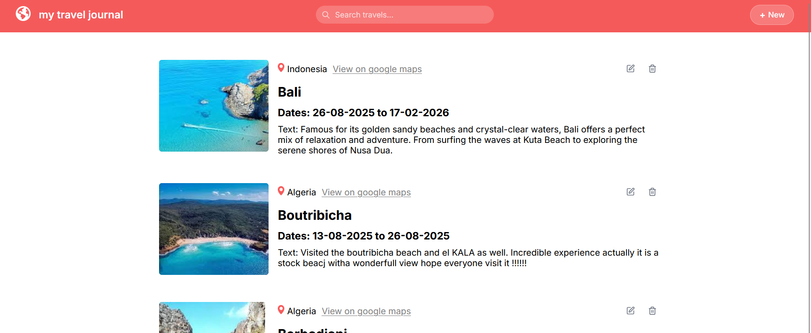

# Travel-journal

> Travel-journal is a simple web application that allows users to document their travels. Users can create, read, update, and delete journal entries, making it easy to keep track of trips, memories, and experiences. It also includes search and filter functionalities for easy access to past entries.



## Table of Contents

- [Installation](#installation)
- [Usage](#usage)
- [Contributing](#contributing)
- [License](#license)
- [Contact Information](#contact-information)

## Installation

> Provide step-by-step instructions on how to install and set up the project.

1. Clone the repository:
    ```bash
    git clone https://github.com/yasminebounasla/Travel-journal.git
    ```
2. Navigate to the project directory:
    ```bash
    cd Travel-journal
    ```
3. Install dependencies:
    ```bash
    npm install   # for backend
    npm run client-install  # for frontend dependencies
    ```
4. Set up the PostgreSQL database:
    - Create a database named `travel_journal_db`.
    - Update the `.env` file with your database credentials:
      ```
      DB_HOST=localhost
      DB_USER=your_db_user
      DB_PASSWORD=your_db_password
      DB_NAME=travel_journal_db
      DB_PORT=5432
      ```
5. Run database migrations or scripts if any:
    ```bash
    npm run migrate
    ```
6. Start the backend server:
    ```bash
    npm run dev
    ```
7. Start the frontend :
    ```bash
    npm run dev
    ```


## Usage

> After installation, you can use Travel-journal to manage your travel entries.

> Describe the various functionalities and how users can interact with them. Include screenshots or GIFs if possible.

## Contributing

1.  Fork the repository.
2.  Create a new branch: `git checkout -b feature/your-feature`
3.  Make your changes.
4.  Commit your changes: `git commit -m 'Add some feature'`
5.  Push to the branch: `git push origin feature/your-feature`
6.  Submit a pull request.

> Be sure to follow the project's coding standards and guidelines.
